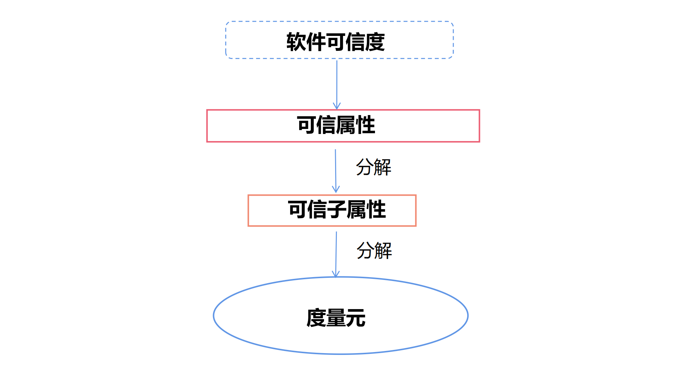
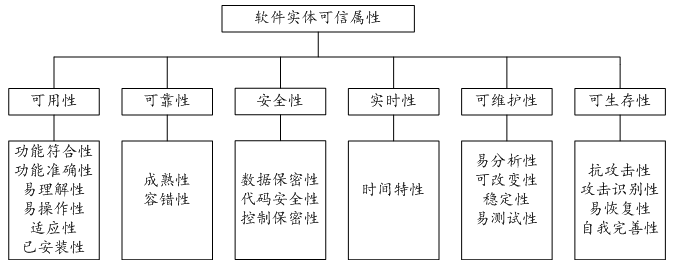
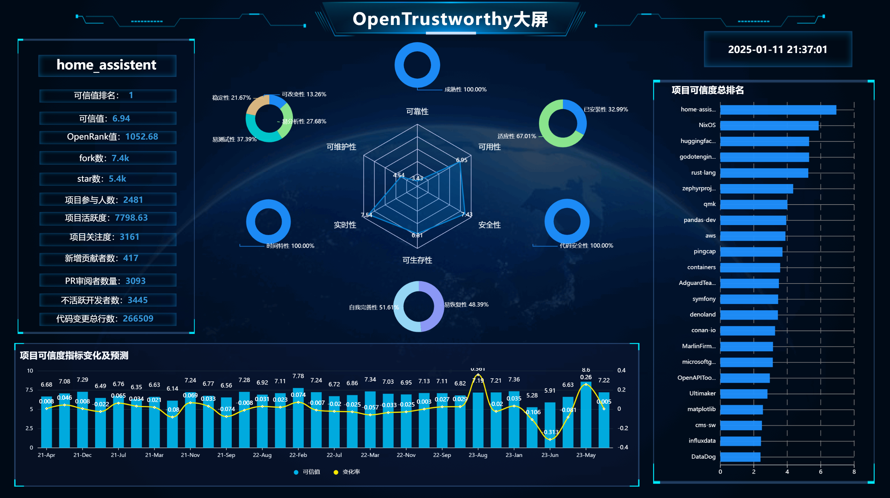
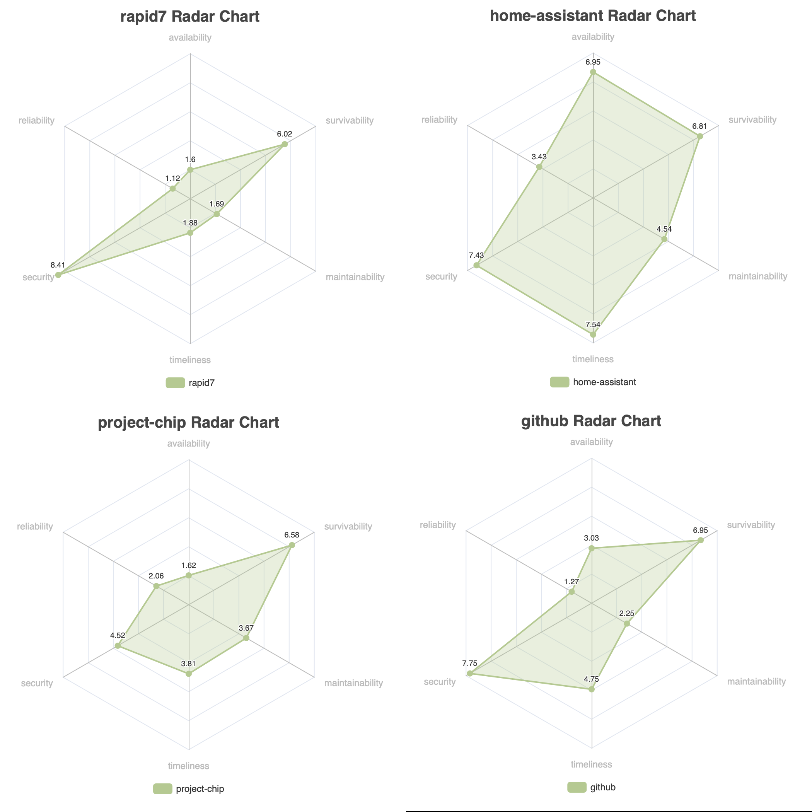
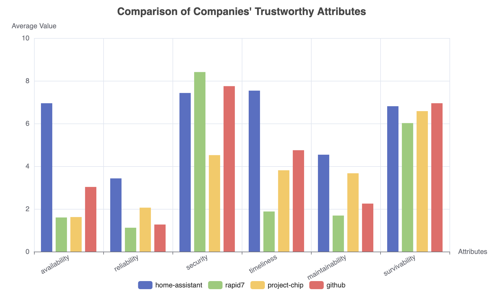

# OpenTrustworthy——开源软件可信性评估与预测工具

## 背景分析

OpenRank 在开源生态中扮演着至关重要的角色。它为开源项目提供了一种量化评估的方式，通过对开源项目的活跃度、贡献者行为、技术趋势等多方面数据的分析，能够清晰地展现开源项目在生态中的地位和影响力。

然而，一个项目热门、OpenRank值高，就意味着它有更好的可信性，有更好的鲁棒性、安全性等可信属性吗？

```
软件的“可信”是指软件系统的动态行为及其结果总是符合人们的预期，在受到干扰时仍能提供连续的服务。（何积丰等《“可信软件基础研究”重大研究计划结题综述》）
```

我们从软件可信度量的角度出发，建立了开源软件可信性评估模型，提出了OpenTrustworthy指标。它反映了项目的可信水平，与OpenRank互补，为开发者们提供有价值的参考。

此外，我们对结果进行了充分可视化，制作了“OpenTrustworthy开源软件可信性评估与预测工具大屏”，还基于XGBoost机器学习算法对软件可信值时间序列进行预测评估。我们还计划通过大语言模型，自动批量生成权威的软件可信报告，进一步丰富开源工具集。

## 项目成果

### 开源软件可信性评估模型

我们基于“`ISO 9126`软件质量评价标准”和“国防科技大学软件可信度量模型”，为开源软件构建了一套**基于属性的软件可信性评估模型**。



具体来说，我们用6个可信属性度量元评估软件的可信度——可用性(Availability)、可靠性(Reliability)、安全性(Security)、实时性(Timeliness)、可维护性(Maintainability)、可生存性(Survivability)。每一个可信属性又被划分为若干可信子属性度量元，具体见下表：



直观来说，软件可信性评估模型中使用类似“加权平均”的方法来计算每个可信子属性、可信属性和总可信值。更多模型细节，详见[理论部分](./second-round/docs/trustworthy_theory.md)。

下表列出了可信属性、可信子属性，以及与之对应的开源项目CHAOSS指标（来自[X-lab2017/open-digger](https://github.com/X-lab2017/open-digger/)）。

| **可信属性**   | **可信子属性**               | **开源项目指标**                                     |
|----------------|------------------------------|------------------------------------------------------|
| **可用性 (Availability)**    | 功能符合性 (Functionality Conformance)  | 无                                                   |
|                | 功能准确性 (Accuracy of Functionality)  | 无                                                   |
|                | 易理解性 (Understandability)  | 无                                                   |
|                | 易操作性 (Operability)       | 无                                                   |
|                | 适应性 (Adaptability)        | `openrank.json`                                       |
|                | 已安装性 (Installability)    | `stars.json`, `technical_fork.json`                   |
| **可靠性 (Reliability)**    | 成熟性 (Maturity)            | `issues_closed.json`                                 |
|                | 容错性 (Fault Tolerance)     | 无                                                   |
| **安全性 (Security)**       | 数据保密性 (Data Confidentiality) | 无                                                   |
|                | 代码安全性 (Code Security)  | `code_change_lines_sum.json`                         |
|                | 控制保密性 (Control Confidentiality) | 无                                                   |
| **实时性 (Timeliness)**     | 时间特性 (Time Characteristics) | `activity.json`, `attention.json`, `bus_factor.json`, `change_request_age.json`, `issue_age.json`, `participants.json` |
| **可维护性 (Maintainability)** | 易分析性 (Analyzability)      | `inactive_contributors.json`, `new_contributors.json` |
|                | 可改变性 (Changeability)     | `code_change_lines_add.json`, `code_change_lines_remove.json` |
|                | 稳定性 (Stability)          | `issues_and_change_request_active.json`, `issues_new.json` |
|                | 易测试性 (Testability)      | `change_requests_reviews.json`                       |
| **可生存性 (Survivability)** | 抗攻击性 (Attack Resistance)  | 无                                                   |
|                | 攻击识别性 (Attack Identification) | 无                                                   |
|                | 易恢复性 (Recoverability)    | `change_request_resolution_duration.json`, `issue_resolution_duration.json` |
|                | 自我完善性 (Self-improvement) | `change_request_response_time.json`, `issue_response_time.json` |

值得关注的是，“项目热门程度”“项目OpenRank值”和“软件可信值”是三个相互关联，但不完全相关的概念。**项目更加热门、OpenRank影响力更大，并不一定意味着该项目中的软件在可信度量下也表现更好**——这也是在OpenRank指标已被提出的情况下，软件可信trustworthy指标的意义所在。

### TOP300流行开源项目可信性可视化

我们分析了前300流行项目指标数据`top300_metrics`，计算这些热门开源软件在各个可信属性上的得分以及总的软件可信值，并可视化。

OpenTrustworthy_开源软件可信性评估与预测工具大屏（详见[OpenTrustworthy大屏](./second-round/docs/demo.md)）：



项目间可信指标对比：





### 基于机器学习的开源软件可信性预测

通过XGBoost机器学习算法，拟合某一开源软件CHAOSS指标中的每一项，并估计未来半年该软件可信性、可信属性的变化。算法细节详见官方文档[XGBoost官方文档](https://xgboost.readthedocs.io/en/stable/index.html)。

之所以选用XGBoost算法，是因为它在项目[OpenSODA](https://atomgit.com/ecnu-vision1/2023-opensoda-final-T3)中取得了很好的效果，尤其是在可解释性方面。

具体来说，XGBoost算法有如下优点：

- **提供了更高的精度**：得益于其对损失函数的二阶泰勒展开，能够自定义损失函数并支持复杂的非线性问题建模；
- **灵活性强**：不仅支持CART树还支持线性分类器，还允许用户自定义损失函数；
- **过拟合风险低**：内置了正则化项，同时采用列抽样技术，降低过拟合风险；
- **有效处理缺失值**：通过稀疏感知算法自动学习最佳分裂方向；
- **支持并行计算**：提高了训练效率；
- **具有交叉验证功能**：有助于优化模型性能。

这些特性使得XGBoost在拟合时间序列时表现优异。在我们的测试中，XGBoost同样在验证集上达到了较高的精度。

## ToDo

### 开源软件可信性报告自动生成

基于大语言模型，为制定开源软件自动生成一份详细的可信性报告，为开发者提供参考。

- [x] 实现通义千问API的调用。
- [ ] 调用 GitHub API 实现实时数据的拉取与更新
- [ ] 生成可信度报告中的可视化图表
- [ ] 生成项目可信度报告


## 代码详解

### 代码结构

```bash
Openrank
	reqirements.txt # 项目依赖文件
	.gitignore # 无需上传到git的文件
	first-round # 初赛相关材料
	second-round # 复赛相关材料
		agent # 软件可信报告自动生成（未完成）
		data # 存放所有的数据
		data_preprocessor # 数据预处理
		docs # 复赛项目文档
		predict # 机器学习软件可信值预测
		trustworthy_model # 软件可信性评估模型
		visualization # 数据可视化
		get_opendigger_data.py # 从opendigger获取CHAOSS数据
		run_project.bat # 在Windows上运行项目
		run_project.sh # 在Linux/MacOS上运行项目
```

### 运行代码

参见[安装指南](./second-round/docs/install.md)
