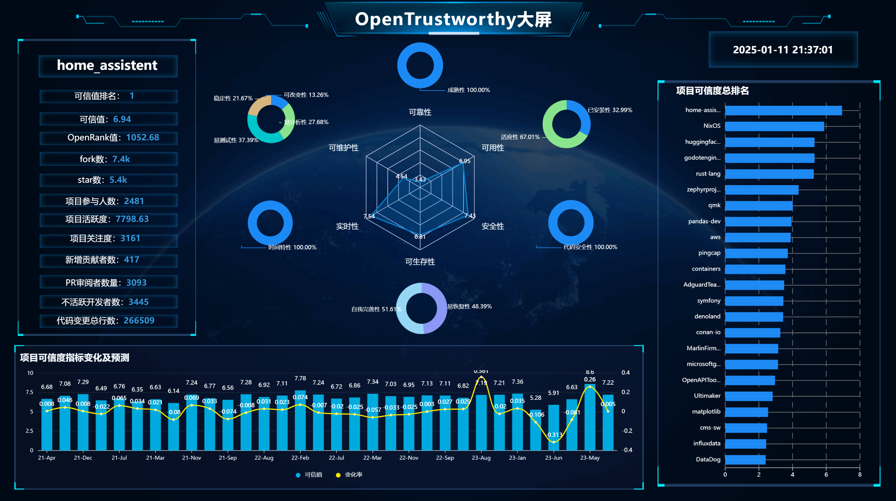

# OpenTrustworthy可视化大屏

本大屏使用`DataEase`工具制作，旨在向用户全面展示项目的**基本信息**、**可信排行榜**、**可信属性分解情况**和**可信趋势呈现及预测**。通过多维数据的可视化分析，帮助用户快速了解特定项目的综合表现，为进一步的决策提供科学依据和数据支持。上图展示的是GitHub上的`home-assistant`项目，它在`TOP300流行项目`中可信排名第一。

## 基本信息
大屏左侧展示了GitHub项目`home-assistant`的基本信息，包括可信值排名、OpenRank值、项目运营情况等。可信值由国防科技大学软件可信度量模型计算得出，其余指标是利用`OpenDigger`工具查找GitHub上2022全年数据总结得出。

## 可信排行榜
大屏最右侧是可信排行榜，展示了`TOP300流行项目`中可信度位居前列的项目的排名情况。

## 可信属性分解情况
大屏中部是`home-assistant`项目在各个可信属性和可信子属性上的得分。在中间的雷达图上展示了可靠性、可用性、安全性、可生存性、可维护性、实时性等六项可信属性的得分。在旁边的环形图中展示了每个可信属性对应的可信子属性，以及每个子属性的权重。

## 可信趋势呈现及预测
大屏底部是`home-assistant`项目从2021年2月到2023年8月的可信值变化以及可信值变化率，其中2021年2月到2023年3月为`OpenDigger`数据，2023年3月到2023年8月为`XGBoost`机器学习预测数据。
